================================================================
Multi-Cluster, Multi-Cloud Networking for Kubernetes - OpenShift
================================================================

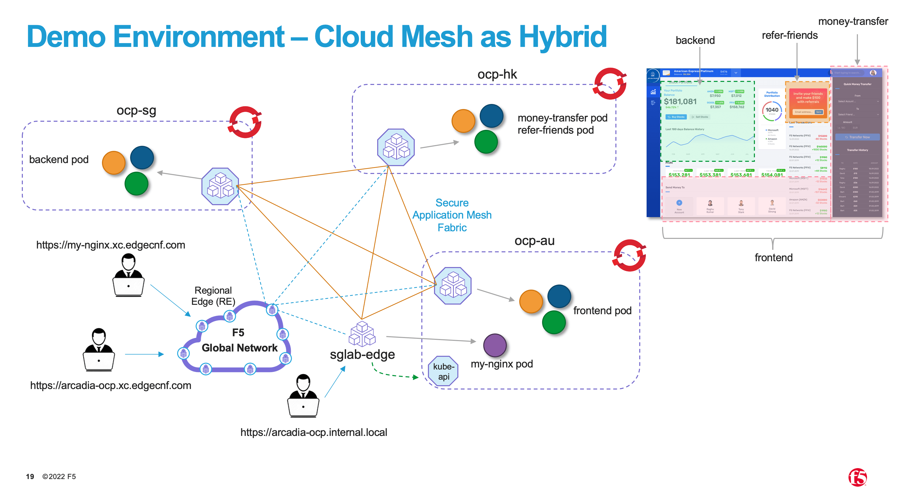

.. contents:: Table of Contents

Objective
################################

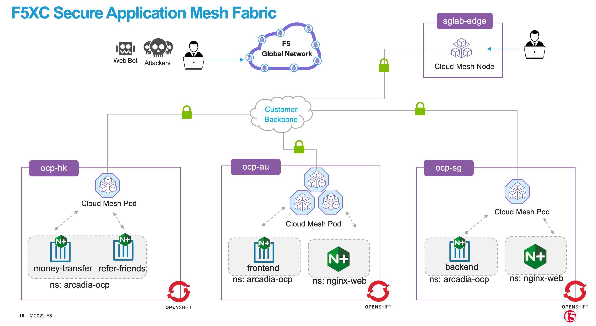

Step 1 - OCP Environment
################################
**1.1  Deploy/Ensure OpenShift Cluster and Ready**
--------------------------------------------------

Building an OCP cluster is beyond the scope of this guide. Please refer to RedHat official documentation. Hence, assumption that you already have an existing OCP up and running. With minor changes, this instruction can be use for non-OCP – EKS, AKS and GKE.

Example of my OCP Environment used in this guide.

- ocp-au - 3 node cluster located in Australia DC
- ocp-sg - Single node cluster locatated in Singpaore DC
- ocp-hk - Single noe cluster located in Hong Kong DC

::

    fbchan@forest:~/ocp-au$ oc get node
    NAME                      STATUS   ROLES           AGE    VERSION
    ocp-au1.ocp.edgecnf.com   Ready    master,worker   163d   v1.22.8+9e95cb9
    ocp-au2.ocp.edgecnf.com   Ready    master,worker   163d   v1.22.8+9e95cb9
    ocp-au3.ocp.edgecnf.com   Ready    master,worker   163d   v1.22.8+9e95cb9
    
    fbchan@forest:~/ocp-sg$ oc get node
    NAME                     STATUS   ROLES           AGE    VERSION
    ocp-sg.ocp.edgecnf.com   Ready    master,worker   275d   v1.23.5+3afdacb
    
    fbchan@forest:~/ocp-hk$ oc get node
    NAME                     STATUS   ROLES           AGE    VERSION
    ocp-hk.ocp.edgecnf.com   Ready    master,worker   159d   v1.22.8+9e95cb9

**1.2 Enable/Ensure kernel hugepages available and sufficient.**
-----------------------------------------------------------------

Note: Only the ocp-au cluster will be shown. Repeat similar task for ocp-sg and ocp-hk

::

    fbchan@forest:~/ocp-au$ oc get node ocp-au1.ocp.edgecnf.com -o jsonpath="{.status.allocatable.hugepages-2Mi}"
    0
    
    fbchan@forest:~/ocp-au$ oc get node ocp-au2.ocp.edgecnf.com -o jsonpath="{.status.allocatable.hugepages-2Mi}"
    0
    
    fbchan@forest:~/ocp-au$ oc get node ocp-au3.ocp.edgecnf.com -o jsonpath="{.status.allocatable.hugepages-2Mi}"
    0

Label nodes (e.g. worker node) with hugepages enabled. In this demo environment, master node also the worker nodes.

::

    fbchan@forest:~/ocp-au$ oc get node
    NAME                      STATUS   ROLES           AGE     VERSION
    ocp-au1.ocp.edgecnf.com   Ready    master,worker   163d    v1.22.8+9e95cb9
    ocp-au2.ocp.edgecnf.com   Ready    master,worker   163d   v1.22.8+9e95cb9
    ocp-au3.ocp.edgecnf.com   Ready    master,worker   163d   v1.22.8+9e95cb9
    
    oc label node ocp-au1.ocp.edgecnf.com node-role.kubernetes.io/worker-hp=
    oc label node ocp-au2.ocp.edgecnf.com node-role.kubernetes.io/worker-hp=
    oc label node ocp-au3.ocp.edgecnf.com node-role.kubernetes.io/worker-hp=
    
    fbchan@forest:~/ocp-au$ oc label node ocp-au1.ocp.edgecnf.com node-role.kubernetes.io/worker-hp=
    node/ocp-au1.ocp.edgecnf.com labeled
    fbchan@forest:~/ocp-au$ oc label node ocp-au2.ocp.edgecnf.com node-role.kubernetes.io/worker-hp=
    node/ocp-au2.ocp.edgecnf.com labeled
    fbchan@forest:~/ocp-au$ oc label node ocp-au3.ocp.edgecnf.com node-role.kubernetes.io/worker-hp=
    node/ocp-au3.ocp.edgecnf.com labeled
    
    fbchan@forest:~/ocp-au$ oc get node
    NAME                      STATUS   ROLES                     AGE     VERSION
    ocp-au1.ocp.edgecnf.com   Ready    master,worker,worker-hp   163d    v1.22.8+9e95cb9
    ocp-au2.ocp.edgecnf.com   Ready    master,worker,worker-hp   163d   v1.22.8+9e95cb9
    ocp-au3.ocp.edgecnf.com   Ready    master,worker,worker-hp   163d   v1.22.8+9e95cb9

Apply OCP tuned operator and machine config operator to enable hugepages.

1-hugepages-tuned-boottime.yaml

::

    apiVersion: tuned.openshift.io/v1
    kind: Tuned
    metadata:
      name: hugepages
      namespace: openshift-cluster-node-tuning-operator
    spec:
      profile:
      - data: |
          [main]
          summary=Boot time configuration for hugepages
          include=openshift-node
          [bootloader]
          cmdline_openshift_node_hugepages=hugepagesz=2M hugepages=1792
        name: openshift-node-hugepages
    
      recommend:
      - machineConfigLabels:
          machineconfiguration.openshift.io/role: "worker-hp"
        priority: 30
        profile: openshift-node-hugepages

2-hugepages-mcp.yaml

::

    apiVersion: machineconfiguration.openshift.io/v1
    kind: MachineConfigPool
    metadata:
      name: worker-hp
      labels:
        worker-hp: ""
    spec:
      machineConfigSelector:
        matchExpressions:
          - {key: machineconfiguration.openshift.io/role, operator: In, values: [worker,worker-hp]}
      nodeSelector:
        matchLabels:
          node-role.kubernetes.io/worker-hp: ""

::

    fbchan@forest:~/ocp-au$ oc create -f 1-hugepages-tuned-boottime.yaml
    tuned.tuned.openshift.io/hugepages created
    
    fbchan@forest:~/ocp-au$ oc create -f 2-hugepages-mcp.yaml
    machineconfigpool.machineconfiguration.openshift.io/worker-hp created

    
Depends on OCP version, if you have access to worker nodes, you can also enable hugepages by editing /etc/sysctl.conf. Example if you enable hugepage using sysctl instead of OCP tuned and mcp operator.

::

    sudo vi /etc/sysctl.conf
    vm.nr_hugepages = 1768
    
    sudo sysctl -p

Reboot worker nodes - if neccessary and validate hugepages

::

    fbchan@forest:~/ocp-au$ oc get node ocp-au1.ocp.edgecnf.com -o jsonpath="{.status.allocatable.hugepages-2Mi}"
    3536Mi
    
    fbchan@forest:~/ocp-au$ oc get node ocp-au2.ocp.edgecnf.com -o jsonpath="{.status.allocatable.hugepages-2Mi}"
    3536Mi
    
    fbchan@forest:~/ocp-au$ oc get node ocp-au3.ocp.edgecnf.com -o jsonpath="{.status.allocatable.hugepages-2Mi}"
    3536Mi

Do not continue until you have hugepages configured. Example above shown that I had hugepage configured.

**1.3 Ensure StorageClass configured and Persistent Volume (PVC) working.**
---------------------------------------------------------------------------

Deployment of CE site on K8S require persistent volume (PV). If you don’t have pv configured, here an example to deploy a NFS provisioner for OCP.

Assuming you already have an NFS server running (e.g. Linux NFS) on a remote server. In my example, 10.176.10.122 is my nfs server, /home/nfs is my nfs path

::

  helm repo add nfs-subdir-external-provisioner https://kubernetes-sigs.github.io/nfs-subdir-external-provisioner/

  helm repo update
  
  oc create namespace openshift-nfs-storage
  
  oc label namespace openshift-nfs-storage "openshift.io/cluster-monitoring=true"
  
  helm install nfs nfs-subdir-external-provisioner/nfs-subdir-external-provisioner \
  --set nfs.server=10.176.10.122 \
  --set nfs.path=/home/nfs \
  --set storageClass.name=managed-nfs \
  --set storageClass.defaultClass=true \
  --set storageClass.onDelete=delete \
  -n openshift-nfs-storage --create-namespace
  
  oc patch storageclass managed-nfs -p '{"metadata": {"annotations":{"storageclass.kubernetes.io/  is-default-class":"true"}}}'

Validate to make sure nfs pod is running

::

  fbchan@forest:~/ocp-au$ oc -n openshift-nfs-storage get pod
  NAME                                      READY   STATUS    RESTARTS   AGE
  nfs-client-provisioner-7cdf6c5f86-dkhkf   1/1     Running   26         152d
  
  fbchan@forest:~/ocp-au$ oc get sc
  NAME                    PROVISIONER                                   RECLAIMPOLICY   VOLUMEBINDINGMODE     ALLOWVOLUMEEXPANSION   AGE
  managed-nfs (default)   k8s-sigs.io/nfs-subdir-external-provisioner   Delete          Immediate             false                  152d

  
Use the sample statefulset manifest below to test to ensure PV and PVC working.

::

  apiVersion: apps/v1
  kind: StatefulSet
  metadata:
    name: busybox
  spec:
    serviceName: busybox
    replicas: 1
    selector:
      matchLabels:
        app: busybox
    template:
      metadata:
        labels:
          app: busybox
      spec:
        containers:
          - image: busybox
            args: [/bin/sh, -c, 'sleep 9999' ]
            volumeMounts:
              - mountPath: /test
                name: busybox-pvc
            name: busybox
    volumeClaimTemplates:
    - metadata:
        name: busybox-pvc
      spec:
        accessModes: [ "ReadWriteOnce" ]
        resources:
          requests:
            storage: 1Gi

Example output

::

  fbchan@forest:~/ocp-au$ oc apply -f busybox-pvc.yaml
  statefulset.apps/busybox created
  
  fbchan@forest:~/ocp-au$ oc get pvc
  NAME                    STATUS   VOLUME                                     CAPACITY   ACCESS MODES     STORAGECLASS   AGE
  busybox-pvc-busybox-0   Bound    pvc-08882259-4ca5-45ee-a426-a2ff69946dfa   1Gi        RWO              managed-nfs    49s
  
  fbchan@forest:~/ocp-au$ oc delete -f busybox-pvc.yaml
  statefulset.apps "busybox" deleted

Step 2 - Deploy Cloud Mesh Pod
################################

**2.1  Download ce_k8s.yaml manifest.**
---------------------------------------

Download CE on K8S site manifest. Manifest can e downloaded ad https://gitlab.com/volterra.io/volterra-ce

::

  fbchan@forest:~/ocp-au$ wget https://gitlab.com/volterra.io/volterra-ce/-/raw/master/k8s/ce_k8s.yml
  --2022-10-26 06:24:27--  https://gitlab.com/volterra.io/volterra-ce/-/raw/master/k8s/ce_k8s.yml
  Resolving gitlab.com (gitlab.com)... 172.65.251.78, 2606:4700:90:0:f22e:fbec:5bed:a9b9
  Connecting to gitlab.com (gitlab.com)|172.65.251.78|:443... connected.
  HTTP request sent, awaiting response... 200 OK
  Length: 6539 (6.4K) [text/plain]
  Saving to: ‘ce_k8s.yml’
  
  ce_k8s.yml                                              100%  [======================================================================================================
  ======================>]   6.39K  --.-KB/s    in 0s
  
  2022-10-26 06:24:28 (94.9 MB/s) - ‘ce_k8s.yml’ saved [6539/6539]

**2.2 Update ce_k8s.yaml deployment according to your env.**
------------------------------------------------------------

Depend on your environment, updates appropriately.

.. figure:: ./images/site-token.png

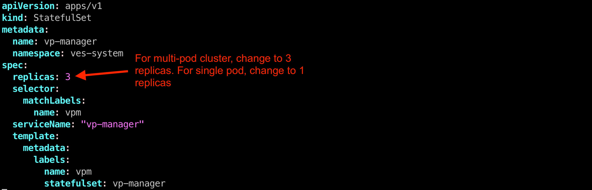

Uncomment Service definition to enable nodeport for site to site access (e.g. site mesh group).

::

  # CHANGE ME
  # PLEASE UNCOMMENT TO ENABLE SITE TO SITE ACCESS VIA NODEPORT
  ---
  apiVersion: v1
  kind: Service
  metadata:
    name: ver-nodeport-ver-0
    namespace: ves-system
    labels:
      app: ver
  spec:
    type: NodePort
    ports:
      - name: "ver-ike"
        protocol: UDP
        port: 4500
        targetPort: 4500
        nodePort: 30500
    selector:
      statefulset.kubernetes.io/pod-name: ver-0
  ---
  apiVersion: v1
  kind: Service
  metadata:
    name: ver-nodeport-ver-1
    namespace: ves-system
    labels:
      app: ver
  spec:
    type: NodePort
    ports:
      - name: "ver-ike"
        protocol: UDP
        port: 4500
        targetPort: 4500
        nodePort: 30501
    selector:
      statefulset.kubernetes.io/pod-name: ver-1
  ---
  apiVersion: v1
  kind: Service
  metadata:
    name: ver-nodeport-ver-2
    namespace: ves-system
    labels:
      app: ver
  spec:
    type: NodePort
    ports:
      - name: "ver-ike"
        protocol: UDP
        port: 4500
        targetPort: 4500
        nodePort: 30502
    selector:
      statefulset.kubernetes.io/pod-name: ver-2

**2.3 Apply ce_k8s.yaml deployment.**
-------------------------------------

::

  fbchan@forest:~/ocp-au$ oc create ns ves-system
  namespace/ves-system created
  
  fbchan@forest:~/ocp-au$ oc adm policy add-scc-to-user privileged -z default -n ves-system
  clusterrole.rbac.authorization.k8s.io/system:openshift:scc:privileged added: "default"
  
  fbchan@forest:~/ocp-au$ oc create -f ce_k8s.yml
  namespace/ves-system created
  serviceaccount/volterra-sa created
  role.rbac.authorization.k8s.io/volterra-admin-role created
  rolebinding.rbac.authorization.k8s.io/volterra-admin-role-binding created
  daemonset.apps/volterra-ce-init created
  serviceaccount/vpm-sa created
  role.rbac.authorization.k8s.io/vpm-role created
  clusterrole.rbac.authorization.k8s.io/vpm-cluster-role created
  rolebinding.rbac.authorization.k8s.io/vpm-role-binding created
  clusterrolebinding.rbac.authorization.k8s.io/vpm-sa created
  clusterrolebinding.rbac.authorization.k8s.io/ver created
  configmap/vpm-cfg created
  statefulset.apps/vp-manager created
  service/vpm created
  
  fbchan@forest:~/ocp-au$ oc -n ves-system get pod,pvc
  NAME                         READY   STATUS    RESTARTS   AGE
  pod/volterra-ce-init-2kdpd   1/1     Running   0          2m20s
  pod/volterra-ce-init-4hh6m   1/1     Running   0          2m20s
  pod/volterra-ce-init-tzwds   1/1     Running   0          2m20s
  pod/vp-manager-0             1/1     Running   0          68s
  pod/vp-manager-1             1/1     Running   0          77s
  pod/vp-manager-2             1/1     Running   0          88s
  
  NAME                                        STATUS   VOLUME                                     CAPACITY   ACCESS   MODES   STORAGECLASS   AGE
  persistentvolumeclaim/data-vp-manager-0     Bound    pvc-1d28203e-4a2d-4126-af4d-825d4bbc9d07   1Gi          RWO            managed-nfs    2m20s
  persistentvolumeclaim/data-vp-manager-1     Bound    pvc-9eeebb9f-c8e9-46fd-8878-4eb00212d79b   1Gi          RWO            managed-nfs    2m8s
  persistentvolumeclaim/data-vp-manager-2     Bound    pvc-e095bbfe-d92e-46a0-8aec-b4dc88906f19   1Gi          RWO            managed-nfs    118s
  persistentvolumeclaim/etcvpm-vp-manager-0   Bound    pvc-490d792e-a1ad-416f-afae-d5d687b10a6d   1Gi          RWO            managed-nfs    2m20s
  persistentvolumeclaim/etcvpm-vp-manager-1   Bound    pvc-228600ea-256b-4214-bc20-02de68011baa   1Gi          RWO            managed-nfs    2m8s
  persistentvolumeclaim/etcvpm-vp-manager-2   Bound    pvc-dc221ff8-695f-45ae-8b84-36ba190f5563   1Gi          RWO            managed-nfs    118s
  persistentvolumeclaim/varvpm-vp-manager-0   Bound    pvc-aa2b9eb5-2c2d-4abd-94e1-eb302eedb47a   1Gi          RWO            managed-nfs    2m20s
  persistentvolumeclaim/varvpm-vp-manager-1   Bound    pvc-4a85c2ac-d78b-43e5-8a70-924f9caea852   1Gi          RWO            managed-nfs    2m8s
  persistentvolumeclaim/varvpm-vp-manager-2   Bound    pvc-de41afd2-f09f-4fc3-a0bd-fa8bc77c37ff   1Gi          RWO            managed-nfs    118s

**2.4 Approve registration of VER on F5 XC Console**
----------------------------------------------------

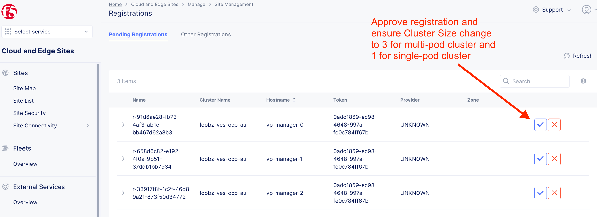

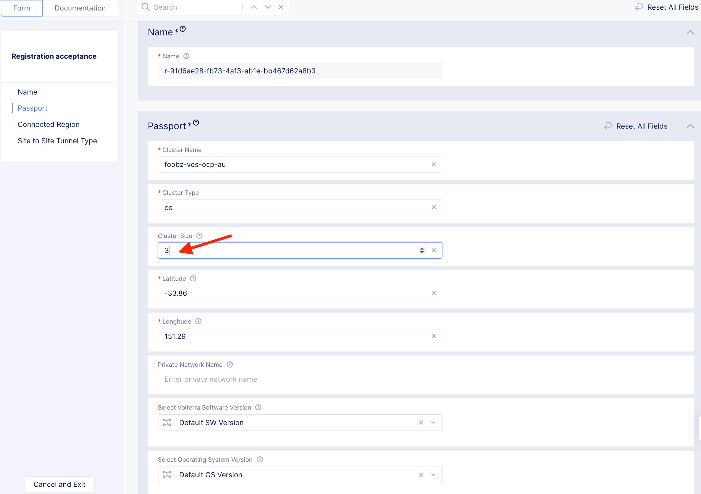

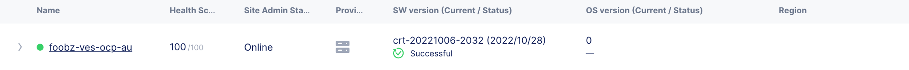

Example running F5 XC Cloud mesh pod on OCP

::

  fbchan@forest:~/ocp-au$ oc -n ves-system get pod
  NAME                          READY   STATUS    RESTARTS      AGE
  etcd-0                        2/2     Running   0             13h
  etcd-1                        2/2     Running   0             13h
  etcd-2                        2/2     Running   0             13h
  prometheus-857f979859-cmts7   5/5     Running   0             13h
  ver-0                         16/16   Running   0             13h
  ver-1                         16/16   Running   0             13h
  ver-2                         16/16   Running   0             13h
  volterra-ce-init-2kdpd        1/1     Running   0             13h
  volterra-ce-init-4hh6m        1/1     Running   0             13h
  volterra-ce-init-tzwds        1/1     Running   0             13h
  vp-manager-0                  1/1     Running   2 (13h ago)   13h
  vp-manager-1                  1/1     Running   1 (13h ago)   13h
  vp-manager-2                  1/1     Running   2 (13h ago)   13h

**2.5 Create ver-dns service**
------------------------------

This is to ensure that ver-dns service has a static ClusterIP. During software updates, ver-0, ver-1 and ver-2 will be restarted and ver pods IP may change. 

::

  fbchan@forest:~/ocp-au$ oc -n ves-system get pod -o wide -l app=ver
  NAME    READY   STATUS    RESTARTS        AGE   IP             NODE                      NOMINATED NODE     READINESS GATES
  ver-0   16/16   Running   15 (162m ago)   12h   10.130.1.132   ocp-au1.ocp.edgecnf.com   <none>           <none>
  ver-1   16/16   Running   19 (101m ago)   12h   10.128.0.44    ocp-au2.ocp.edgecnf.com   <none>           <none>
  ver-2   16/16   Running   7 (5m23s ago)   12h   10.129.0.144   ocp-au3.ocp.edgecnf.com   <none>           <none>

dns-ver-svc.yaml

::

  apiVersion: v1
  kind: Service
  metadata:
    name: ver-dns
    namespace: ves-system
    labels:
      app: ver
  spec:
    ports:
      - name: "ver-dns-udp"
        protocol: UDP
        port: 53
        targetPort: 53
      - name: "ver-dns-tcp"
        protocol: TCP
        port: 53
        targetPort: 53
    selector:
      app: ver

:: 

  kubectl -n ves-system apply -f dns-ver-svc.yaml

  fbchan@forest:~/ocp-au$ oc -n ves-system get svc ver-dns
  NAME      TYPE        CLUSTER-IP    EXTERNAL-IP   PORT(S)         AGE
  ver-dns   ClusterIP   172.30.5.75   <none>        53/UDP,53/TCP   143d

**2.6 Update OCP DNS Operator to delegate domain to ver-dns**
-------------------------------------------------------------

Note: If you using other Kubernetes, you may need to update CoreDNS/KubeDNS or the respective Kubernetes.

DNS default configmap before update with DNS Operator

::

  fbchan@forest:~/ocp-au$ oc -n openshift-dns get cm dns-default -o yaml
  apiVersion: v1
  data:
    Corefile: |
      .:5353 {
          bufsize 512
          errors
          health {
              lameduck 20s
          }
          ready
          kubernetes cluster.local in-addr.arpa ip6.arpa {
              pods insecure
              fallthrough in-addr.arpa ip6.arpa
          }
          prometheus 127.0.0.1:9153
          forward . /etc/resolv.conf {
              policy sequential
          }
          cache 900 {
              denial 9984 30
          }
          reload
      }
  kind: ConfigMap
  metadata:
    creationTimestamp: "2022-11-01T00:22:52Z"
    labels:
      dns.operator.openshift.io/owning-dns: default
    name: dns-default
    namespace: openshift-dns
    ownerReferences:
    - apiVersion: operator.openshift.io/v1
      controller: true
      kind: DNS
      name: default
      uid: 1c629cc8-f060-4e99-a8d1-dd5c2be42ccd
    resourceVersion: "2184645"
    uid: d3866bc7-31f5-453f-b9d7-6315d85af400

Upates DNS operator to delegate xcmesh.global to Cloud Mesh pod.
Note: "xcmesh.global" domain will be use in Multi-Cloud App Connect configuration. 

dns-operator-ocp-au.yaml

::

  apiVersion: operator.openshift.io/v1
  kind: DNS
  metadata:
    name: default
  spec:
    servers:
    - name: xcmesh-global-dns
      zones:
        - xcmesh.global
      forwardPlugin:
        upstreams:
          - 172.30.5.75

oc apply -f dns-operator-ocp-au.yaml

::

  fbchan@forest:~/ocp-au$ oc apply -f dns-operator-ocp-au.yaml
  Warning: resource dnses/default is missing the kubectl.kubernetes.io/last-applied-configuration annotation which   is required by oc apply. oc apply should only be used on resources created declaratively by either oc create   --save-config or oc apply. The missing annotation will be patched automatically.
  dns.operator.openshift.io/default configured

After DNS operator updated

::

  apiVersion: v1
  data:
    Corefile: |
      # xcmesh-global-dns
      xcmesh.global:5353 {
          forward . 172.30.5.75
          errors
          bufsize 512
      }
      .:5353 {
          bufsize 512
          errors
          health {
              lameduck 20s
          }
          ready
          kubernetes cluster.local in-addr.arpa ip6.arpa {
              pods insecure
              fallthrough in-addr.arpa ip6.arpa
          }
          prometheus 127.0.0.1:9153
          forward . /etc/resolv.conf {
              policy sequential
          }
          cache 900 {
              denial 9984 30
          }
          reload
      }
  kind: ConfigMap
  metadata:
    creationTimestamp: "2022-11-01T00:22:52Z"
    labels:
      dns.operator.openshift.io/owning-dns: default
    name: dns-default
    namespace: openshift-dns
    ownerReferences:
    - apiVersion: operator.openshift.io/v1
      controller: true
      kind: DNS
      name: default
      uid: 1c629cc8-f060-4e99-a8d1-dd5c2be42ccd
    resourceVersion: "8590070"
    uid: d3866bc7-31f5-453f-b9d7-6315d85af400 

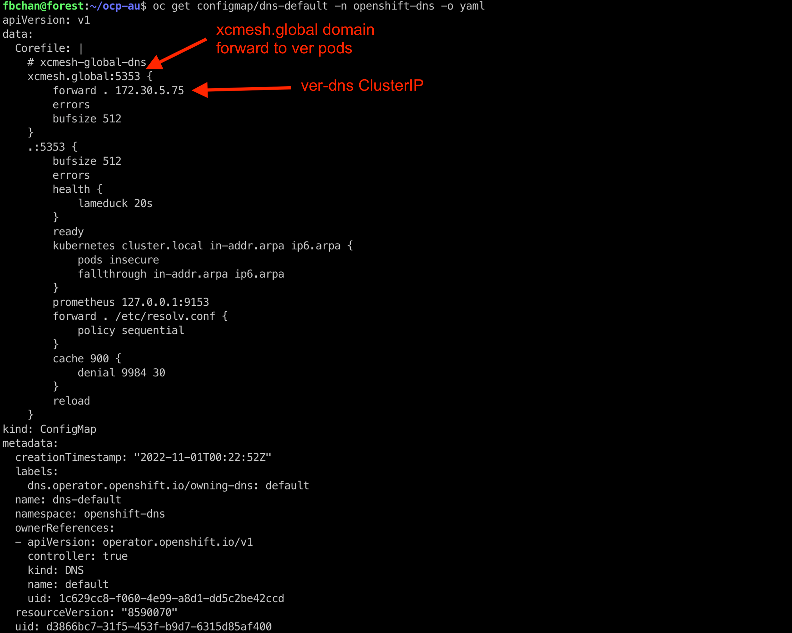

Repeat similar registration for ocp-sg and ocp-hk site.

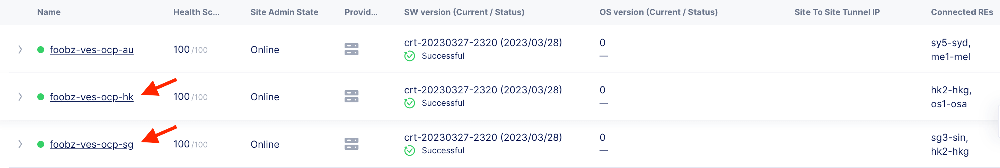

**Cloud Mesh Pod with OpenShift Environment**
---------------------------------------------

**ocp-au**

::

  fbchan@forest:~/ocp-au$ oc get node
  NAME                      STATUS   ROLES                     AGE    VERSION
  ocp-au1.ocp.edgecnf.com   Ready    master,worker,worker-hp   166d   v1.22.8+9e95cb9
  ocp-au2.ocp.edgecnf.com   Ready    master,worker,worker-hp   166d   v1.22.8+9e95cb9
  ocp-au3.ocp.edgecnf.com   Ready    master,worker,worker-hp   166d   v1.22.8+9e95cb9

  fbchan@forest:~/ocp-au$ oc -n ves-system get pod,svc,pvc
  NAME                              READY   STATUS    RESTARTS        AGE
  pod/etcd-0                        2/2     Running   2               25d
  pod/etcd-1                        2/2     Running   2               25d
  pod/etcd-2                        2/2     Running   2               25d
  pod/prometheus-7b6dfc8f8d-5vcf2   5/5     Running   5               25d
  pod/ver-0                         16/16   Running   389 (10m ago)   14d
  pod/ver-1                         16/16   Running   392 (33m ago)   14d
  pod/ver-2                         16/16   Running   134 (33m ago)   14d
  pod/volterra-ce-init-4jq8s        1/1     Running   1               158d
  pod/volterra-ce-init-89djm        1/1     Running   1               158d
  pod/volterra-ce-init-nbps7        1/1     Running   1               158d
  pod/vp-manager-0                  1/1     Running   2 (85m ago)     15d
  pod/vp-manager-1                  1/1     Running   3 (82m ago)     15d
  pod/vp-manager-2                  1/1     Running   3 (82m ago)     15d
  
  NAME                         TYPE        CLUSTER-IP       EXTERNAL-IP   PORT(S)                                                                                                                                                                                                                                                                                                     AGE
  service/etcd                 ClusterIP   None             <none>        2379/TCP,2380/TCP,65535/TCP                                                                                                                                                                                                                                                                                 158d
  service/etcd-0               ClusterIP   172.30.33.212    <none>        2379/TCP,2380/TCP,65535/TCP                                                                                                                                                                                                                                                                                 158d
  service/etcd-1               ClusterIP   172.30.117.212   <none>        2379/TCP,2380/TCP,65535/TCP                                                                                                                                                                                                                                                                                 158d
  service/etcd-2               ClusterIP   172.30.255.200   <none>        2379/TCP,2380/TCP,65535/TCP                                                                                                                                                                                                                                                                                 158d
  service/prometheus           ClusterIP   172.30.40.59     <none>        32222/TCP                                                                                                                                                                                                                                                                                                   158d
  service/prometheus-statsd    ClusterIP   172.30.138.160   <none>        65341/TCP,65341/UDP                                                                                                                                                                                                                                                                                         158d
  service/pushgateway          ClusterIP   172.30.194.143   <none>        65220/TCP                                                                                                                                                                                                                                                                                                   158d
  service/ver                  NodePort    172.30.159.50    <none>        8005:30805/TCP,9999:31885/TCP,8505:30855/TCP,9005:30905/TCP,9505:30955/TCP,18095:30906/TCP,18091:30817/TCP,18092:30101/TCP,18093:31583/TCP,18094:30171/TCP,65042:31628/TCP,9007:31471/TCP,65040:31450/TCP,65041:30605/TCP,65045:30675/TCP,65111:31289/TCP,65110:30975/TCP,65112:30514/TCP,65131:31832/TCP   158d
  service/ver-dns              ClusterIP   172.30.5.75      <none>        53/UDP,53/TCP                                                                                                                                                                                                                                                                                               146d
  service/ver-nodeport-ver-0   NodePort    172.30.93.207    <none>        4500:30500/UDP                                                                                                                                                                                                                                                                                              158d
  service/ver-nodeport-ver-1   NodePort    172.30.29.116    <none>        4500:30501/UDP                                                                                                                                                                                                                                                                                              158d
  service/ver-nodeport-ver-2   NodePort    172.30.221.221   <none>        4500:30502/UDP                                                                                                                                                                                                                                                                                              158d
  service/vpm                  NodePort    172.30.86.82     <none>        65003:30322/TCP                                                                                                                                                                                                                                                                                             158d
  
  NAME                                        STATUS   VOLUME                                     CAPACITY   ACCESS MODES   STORAGECLASS   AGE
  persistentvolumeclaim/data-etcd-0           Bound    pvc-cecfb17a-8627-43c0-912a-fe3670eacdcb   5Gi        RWO            managed-nfs    158d
  persistentvolumeclaim/data-etcd-1           Bound    pvc-88c77314-5e98-483d-940c-c6eaed687bbc   5Gi        RWO            managed-nfs    158d
  persistentvolumeclaim/data-etcd-2           Bound    pvc-6efc1dbb-049c-4bad-91a6-d477b97221ce   5Gi        RWO            managed-nfs    158d
  persistentvolumeclaim/data-vp-manager-0     Bound    pvc-df5746a1-f0d1-454e-ac22-5dea3d144694   1Gi        RWO            managed-nfs    158d
  persistentvolumeclaim/data-vp-manager-1     Bound    pvc-20b46956-251d-46e0-b0c3-416e3e384b6f   1Gi        RWO            managed-nfs    158d
  persistentvolumeclaim/data-vp-manager-2     Bound    pvc-37a77d6a-8666-42d3-8e55-f19464c2bdf5   1Gi        RWO            managed-nfs    158d
  persistentvolumeclaim/etcvpm-vp-manager-0   Bound    pvc-79440590-63d0-421f-9a6e-54cb27e77478   1Gi        RWO            managed-nfs    158d
  persistentvolumeclaim/etcvpm-vp-manager-1   Bound    pvc-17d35b6c-8d92-4199-a997-98ffa6d3b45d   1Gi        RWO            managed-nfs    158d
  persistentvolumeclaim/etcvpm-vp-manager-2   Bound    pvc-7efc8eaa-a1ea-4f65-b827-93da3faa5c8c   1Gi        RWO            managed-nfs    158d
  persistentvolumeclaim/varvpm-vp-manager-0   Bound    pvc-18e85250-d34e-439d-aab2-02c2d709e59a   1Gi        RWO            managed-nfs    158d
  persistentvolumeclaim/varvpm-vp-manager-1   Bound    pvc-8d0a2bac-1324-48cc-8a97-dd7a8a5241c2   1Gi        RWO            managed-nfs    158d
  persistentvolumeclaim/varvpm-vp-manager-2   Bound    pvc-91279d3e-70be-4505-a319-5e3be543a259   1Gi        RWO            managed-nfs    158d

**ocp-sg**

::

  fbchan@forest:~/ocp-sg$ oc get node
  NAME                     STATUS   ROLES                     AGE    VERSION
  ocp-sg.ocp.edgecnf.com   Ready    master,worker,worker-hp   278d   v1.23.5+3afdacb

  fbchan@forest:~/ocp-sg$ oc -n ves-system get pod,svc,pvc
  NAME                              READY   STATUS    RESTARTS        AGE
  pod/etcd-0                        2/2     Running   2               25d
  pod/prometheus-6bbc5d7f5b-q5qkc   5/5     Running   6 (15d ago)     25d
  pod/ver-0                         16/16   Running   217 (27m ago)   14d
  pod/volterra-ce-init-tg7q8        1/1     Running   2               158d
  pod/vp-manager-0                  1/1     Running   4 (87m ago)     15d
  
  NAME                         TYPE        CLUSTER-IP       EXTERNAL-IP   PORT(S)                                                                                                                                                                                                                                                                                                     AGE
  service/etcd                 ClusterIP   None             <none>        2379/TCP,2380/TCP,65535/TCP                                                                                                                                                                                                                                                                                 158d
  service/etcd-0               ClusterIP   172.30.222.198   <none>        2379/TCP,2380/TCP,65535/TCP                                                                                                                                                                                                                                                                                 158d
  service/prometheus           ClusterIP   172.30.164.191   <none>        32222/TCP                                                                                                                                                                                                                                                                                                   158d
  service/prometheus-statsd    ClusterIP   172.30.22.29     <none>        65341/TCP,65341/UDP                                                                                                                                                                                                                                                                                         158d
  service/pushgateway          ClusterIP   172.30.48.60     <none>        65220/TCP                                                                                                                                                                                                                                                                                                   158d
  service/ver                  NodePort    172.30.20.27     <none>        8005:30805/TCP,9999:32618/TCP,8505:30855/TCP,9005:30905/TCP,9505:30955/TCP,18095:31110/TCP,18091:30178/TCP,18092:31793/TCP,18093:32386/TCP,18094:30408/TCP,65042:32556/TCP,9007:30661/TCP,65040:31048/TCP,65041:30623/TCP,65045:31260/TCP,65111:32423/TCP,65110:31387/TCP,65112:30701/TCP,65131:31362/TCP   158d
  service/ver-dns              ClusterIP   172.30.109.190   <none>        53/UDP,53/TCP                                                                                                                                                                                                                                                                                               146d
  service/ver-nodeport-ver-0   NodePort    172.30.167.128   <none>        4500:30500/UDP                                                                                                                                                                                                                                                                                              158d
  service/vpm                  NodePort    172.30.191.97    <none>        65003:30908/TCP                                                                                                                                                                                                                                                                                             158d
  
  NAME                                        STATUS   VOLUME                                     CAPACITY   ACCESS MODES   STORAGECLASS   AGE
  persistentvolumeclaim/data-etcd-0           Bound    pvc-a895608f-9ca2-4cec-aacd-57260390e20e   5Gi        RWO            managed-nfs    158d
  persistentvolumeclaim/data-vp-manager-0     Bound    pvc-4e533c13-71a0-45ce-861b-63d524f29864   1Gi        RWO            managed-nfs    158d
  persistentvolumeclaim/etcvpm-vp-manager-0   Bound    pvc-3ffe2e17-cca9-4170-bcf8-61fe6df132d7   1Gi        RWO            managed-nfs    158d
  persistentvolumeclaim/varvpm-vp-manager-0   Bound    pvc-42436766-4795-4ea3-98f3-853a89f243c0   1Gi        RWO            managed-nfs    158d

**ocp-hk**

::

  fbchan@forest:~/ocp-hk$ oc get node
  NAME                     STATUS   ROLES           AGE    VERSION
  ocp-hk.ocp.edgecnf.com   Ready    master,worker   163d   v1.22.8+9e95cb9

  fbchan@forest:~/ocp-hk$ oc -n ves-system get pod,svc,pvc
  NAME                              READY   STATUS    RESTARTS      AGE
  pod/etcd-0                        2/2     Running   3             25d
  pod/prometheus-6fccdbb8f8-x7rrh   5/5     Running   9 (15d ago)   25d
  pod/ver-0                         16/16   Running   2 (14d ago)   14d
  pod/volterra-ce-init-x4dqz        1/1     Running   2             158d
  pod/vp-manager-0                  1/1     Running   4 (88m ago)   15d
  
  NAME                         TYPE        CLUSTER-IP       EXTERNAL-IP   PORT(S)                                                                                                                                                                                                                                                                                                     AGE
  service/etcd                 ClusterIP   None             <none>        2379/TCP,2380/TCP,65535/TCP                                                                                                                                                                                                                                                                                 158d
  service/etcd-0               ClusterIP   172.30.254.126   <none>        2379/TCP,2380/TCP,65535/TCP                                                                                                                                                                                                                                                                                 158d
  service/prometheus           ClusterIP   172.30.30.201    <none>        32222/TCP                                                                                                                                                                                                                                                                                                   158d
  service/prometheus-statsd    ClusterIP   172.30.81.123    <none>        65341/TCP,65341/UDP                                                                                                                                                                                                                                                                                         158d
  service/pushgateway          ClusterIP   172.30.101.3     <none>        65220/TCP                                                                                                                                                                                                                                                                                                   158d
  service/ver                  NodePort    172.30.98.130    <none>        8005:30805/TCP,9999:31893/TCP,8505:30855/TCP,9005:30905/TCP,9505:30955/TCP,18095:32442/TCP,18091:31572/TCP,18092:31636/TCP,18093:30359/TCP,18094:31729/TCP,65042:30316/TCP,9007:32339/TCP,65040:31414/TCP,65041:30070/TCP,65045:30167/TCP,65111:32670/TCP,65110:30723/TCP,65112:31048/TCP,65131:31381/TCP   158d
  service/ver-dns              ClusterIP   172.30.220.29    <none>        53/UDP,53/TCP                                                                                                                                                                                                                                                                                               145d
  service/ver-nodeport-ver-0   NodePort    172.30.107.197   <none>        4500:30500/UDP                                                                                                                                                                                                                                                                                              158d
  service/vpm                  NodePort    172.30.3.198     <none>        65003:32592/TCP                                                                                                                                                                                                                                                                                             158d
  
  NAME                                        STATUS   VOLUME                                     CAPACITY   ACCESS MODES   STORAGECLASS   AGE
  persistentvolumeclaim/data-etcd-0           Bound    pvc-87af3345-90ed-40b1-a72b-ae000b00094e   5Gi        RWO            managed-nfs    158d
  persistentvolumeclaim/data-vp-manager-0     Bound    pvc-b3959849-58cf-46a8-90dc-8b3c86d40cf6   1Gi        RWO            managed-nfs    158d
  persistentvolumeclaim/etcvpm-vp-manager-0   Bound    pvc-d52ca368-1998-4031-9d90-413365142c9c   1Gi        RWO            managed-nfs    158d
  persistentvolumeclaim/varvpm-vp-manager-0   Bound    pvc-30988076-54a0-4cd5-9b79-2699e8357c66   1Gi        RWO            managed-nfs    158d

Step 3 - Deploy Cloud Mesh Node
####################################

**3.1 Deploy Cloud Mesh Node.**
-------------------------------

Depends on the type of Cloud Mesh Node (VMware, KVM or Cloud Site), please refer official documentation to spin up a Cloud Mesh node. This guide assume that you already has a running Cloud Mesh Node. This guide written based on a VMWare Cloud Node site - Secure Mesh Site.

**Secure Mesh Site**

https://docs.cloud.f5.com/docs/how-to/site-management/create-secure-mesh-site

**VMWare Site**

https://docs.cloud.f5.com/docs/how-to/site-management/create-vmw-site

**KVM Site**

https://docs.cloud.f5.com/docs/how-to/site-management/create-kvm-libvirt-site

**AWS Site**

https://docs.cloud.f5.com/docs/how-to/site-management/create-aws-site

**Azure Site**

https://docs.cloud.f5.com/docs/how-to/site-management/create-azure-site

**GCP Site**

https://docs.cloud.f5.com/docs/how-to/site-management/create-gcp-site

**3.2 Create service account for Mesh node service discovery.**
---------------------------------------------------------------

For Cloud Mesh nodes reside outside of OCP, service discovery is neccessary for Cloud Mesh Node to discover pod lifecycle. A read-only limited credential (service account) will be created to be imported into Cloud Mesh Node. 

Create ClusterRole
~~~~~~~~~~~~~~~~~~

Cluster Role only have limited privilege (e.g. Read-Only)

01-xc-svc-discovery-cr.yaml
::

  apiVersion: rbac.authorization.k8s.io/v1
  kind: ClusterRole
  metadata:
    name: xc-svc-discovery-cr
  rules:
  - apiGroups: [""]
    resources:
    - services
    - endpoints
    - pods
    - nodes
    - nodes/proxy
    - namespaces
    verbs: ["get", "list", "watch"]

::

  fbchan@forest:~/ocp-au/xc-svc-discovery$ oc apply -f 01-xc-svc-discovery-cr.yaml
  clusterrole.rbac.authorization.k8s.io/xc-svc-discovery-cr created

Create Service account
~~~~~~~~~~~~~~~~~~~~~~

02-xc-svc-discovery-sa.yaml
::

  apiVersion: v1
  kind: ServiceAccount
  metadata:
    name: xc-svc-discovery-sa
    namespace: default
  ---
  apiVersion: rbac.authorization.k8s.io/v1
  kind: ClusterRoleBinding
  metadata:
    name: xc-svc-discovery-crb
  roleRef:
    apiGroup: rbac.authorization.k8s.io
    kind: ClusterRole
    name: xc-svc-discovery-cr
  subjects:
  - kind: ServiceAccount
    name: xc-svc-discovery-sa
    namespace: default

::

  fbchan@forest:~/ocp-au/xc-svc-discovery$ oc apply -f 02-xc-svc-discovery-sa.yaml
  serviceaccount/xc-svc-discovery-sa created
  clusterrolebinding.rbac.authorization.k8s.io/xc-svc-discovery-crb created
  

Create/Export kubeconfig file
~~~~~~~~~~~~~~~~~~~~~~~~~~~~~

03-export-sa.sh
::

  export USER_TOKEN_NAME=$(kubectl -n default get serviceaccount xc-svc-discovery-sa -o=jsonpath='{.secrets[0].name}')
  export USER_TOKEN_VALUE=$(kubectl -n default get secret/${USER_TOKEN_NAME} -o=go-template='{{.data.token}}' | base64 --decode)
  export CURRENT_CONTEXT=$(kubectl config current-context)
  export CURRENT_CLUSTER=$(kubectl config view --raw -o=go-template='{{range .contexts}}{{if eq .name "'''${CURRENT_CONTEXT}'''"}}{{ index .context "cluster" }}{{end}}{{end}}')
  export CLUSTER_CA=$(kubectl config view --raw -o=go-template='{{range .clusters}}{{if eq .name "'''${CURRENT_CLUSTER}'''"}}"{{with index .cluster "certificate-authority-data" }}{{.}}{{end}}"{{ end }}{{ end }}')
  export CLUSTER_SERVER=$(kubectl config view --raw -o=go-template='{{range .clusters}}{{if eq .name "'''${CURRENT_CLUSTER}'''"}}{{ .cluster.server }}{{end}}{{ end }}')
  
  cat << EOF > xc-svc-discovery-sa-default-kubeconfig
  apiVersion: v1
  kind: Config
  current-context: ${CURRENT_CONTEXT}
  contexts:
  - name: ${CURRENT_CONTEXT}
    context:
      cluster: ${CURRENT_CONTEXT}
      user: foobang.chan@f5.com
      namespace: default
  clusters:
  - name: ${CURRENT_CONTEXT}
    cluster:
      certificate-authority-data: ${CLUSTER_CA}
      server: ${CLUSTER_SERVER}
  users:
  - name: foobang.chan@f5.com
    user:
      token: ${USER_TOKEN_VALUE}
  EOF

::

  fbchan@forest:~/ocp-au/xc-svc-discovery$ ./03-export-sa.sh
  fbchan@forest:~/ocp-au/xc-svc-discovery$ ls
  01-xc-svc-discovery-cr.yaml  02-xc-svc-discovery-sa.yaml  03-export-sa.sh  xc-svc-discovery-sa-default-kubeconfig
  fbchan@forest:~/ocp-au/xc-svc-discovery$
  
  
  fbchan@forest:~/ocp-au/xc-svc-discovery$ cat xc-svc-discovery-sa-default-kubeconfig
  apiVersion: v1
  kind: Config
  current-context: admin
  contexts:
  - name: admin
    context:
      cluster: admin
      user: foobang.chan@f5.com
      namespace: default
  clusters:
  - name: admin
    cluster:
      certificate-authority-data: "LS0xxx="
      server: https://api.ocp-au.ocp.edgecnf.com:6443
  users:
  - name: foobang.chan@f5.com
    user:
      token: xxxx

**3.3 Setup service discovery of Mesh Node to OCP**
---------------------------------------------------
For the purpose of this guideline/demo, service discovery on ocp-au from Cloud Mesh Node being shown.

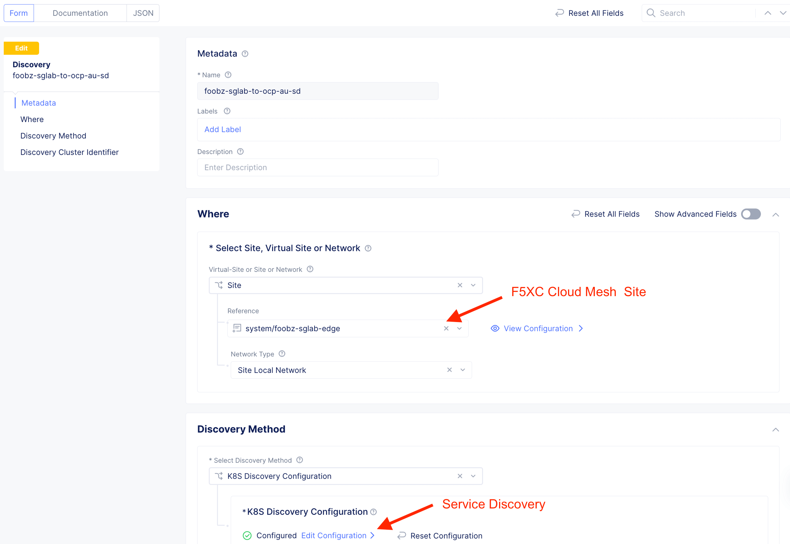

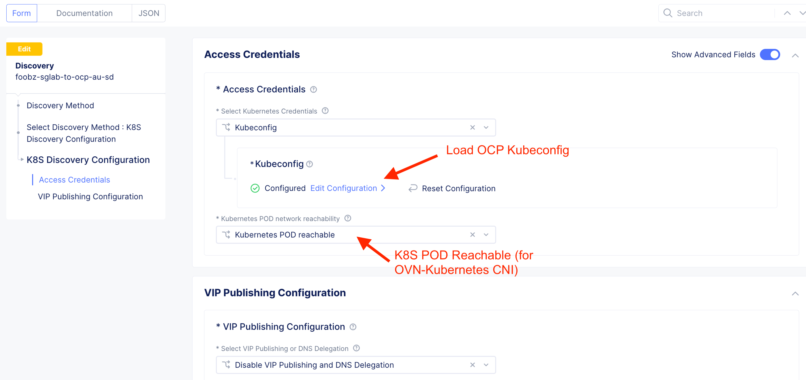

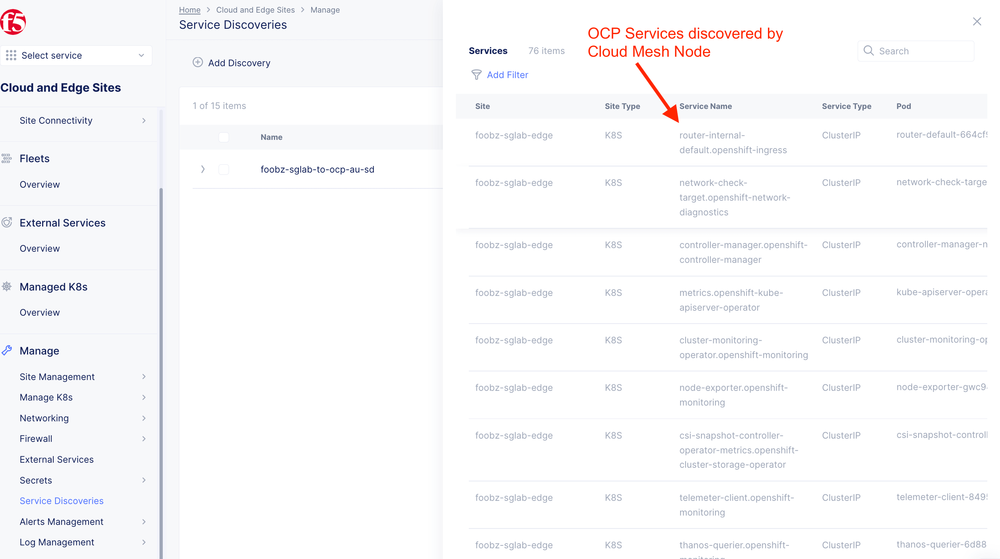

**3.4 Setup pod network routing for ovn-kubernetes.**

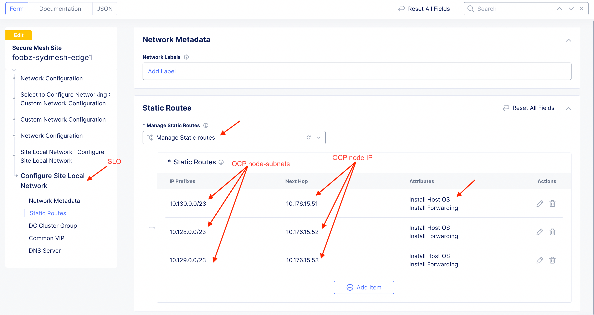

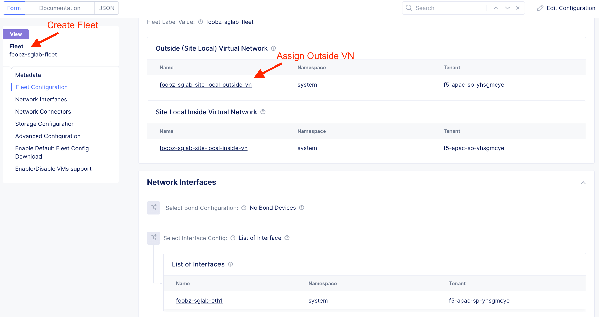

**Cloud Mesh Node with OpenShift Environment**
-----------------------------------------------

Step 4 - Deploy application on OpenShift
###############################################

**4.1 Install Apps (Arcadia)**
------------------------------
Arcadia microservices application will be use to demonstrate distriburted apps capabilites of F5 Multi-Cloud App Connect. Various microservices will be distributed across multiple OpenShift cluster. 

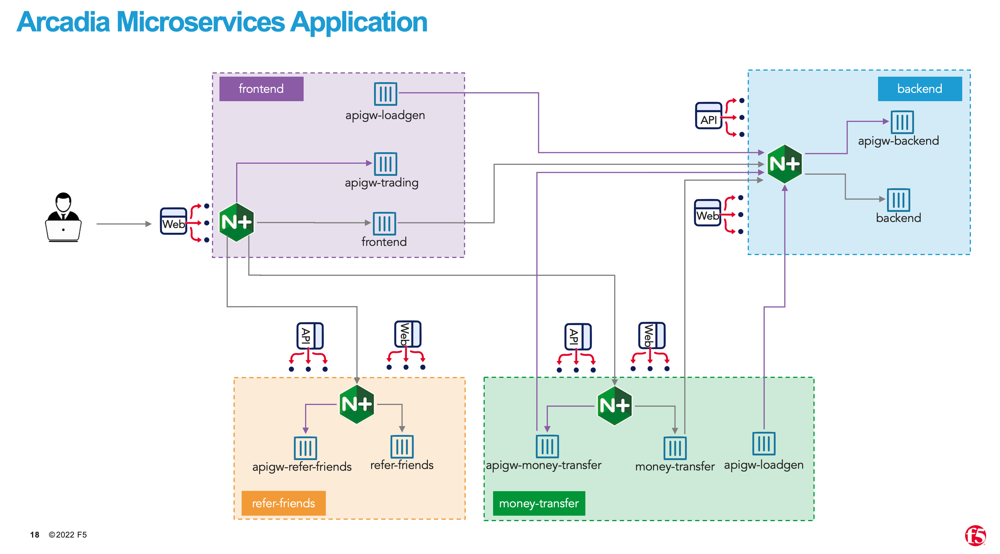

**ocp-au**

::

  fbchan@forest:~/ocp-au$ oc create ns arcadia-ocp
  namespace/arcadia-ocp created

  fbchan@forest:~/ocp-au/f5xc-multicluster-mcn-for-openshift/arcadia-ocp$ oc -n arcadia-ocp apply -f frontend/
  configmap/api-gw.json created
  configmap/api-gw-fe.json created
  deployment.apps/frontend created
  service/frontend created
  configmap/fe-to-money-backend-referfriends-postman.json created
  configmap/fe-to-money-backend-referfriends-postman.json configured
  configmap/sc-nginx-conf-fe-cm created
  configmap/sc-nginx-default-conf-9090-fe-cm created
  configmap/run-apigen-fe.sh created

  fbchan@forest:~/ocp-au/f5xc-multicluster-mcn-for-openshift/arcadia-ocp$ oc -n arcadia-ocp get pod,svc
  NAME                            READY   STATUS    RESTARTS   AGE
  pod/frontend-6f866c5b57-rqwv8   4/4     Running   0          44s
  
  NAME               TYPE        CLUSTER-IP      EXTERNAL-IP   PORT(S)   AGE
  service/frontend   ClusterIP   172.30.158.90   <none>        80/TCP    45s

**ocp-sg**

::

  fbchan@forest:~/ocp-sg$ oc create ns arcadia-ocp
  namespace/arcadia-ocp created

  fbchan@forest:~/ocp-sg/f5xc-multicluster-mcn-for-openshift/arcadia-ocp$ oc -n arcadia-ocp apply -f backend/
  configmap/api-gw-be.json created
  configmap/api-gw.json created
  deployment.apps/backend created
  service/backend created
  configmap/sc-nginx-default-conf-9090-be-cm created
  

  fbchan@forest:~/ocp-sg/f5xc-multicluster-mcn-for-openshift/arcadia-ocp$ oc -n arcadia-ocp get pod,svc
  NAME                           READY   STATUS    RESTARTS   AGE
  pod/backend-576d768fd6-nmfx8   3/3     Running   0          17s
  
  NAME              TYPE        CLUSTER-IP      EXTERNAL-IP   PORT(S)   AGE
  service/backend   ClusterIP   172.30.68.153   <none>        80/TCP    17s

**ocp-hk**

::

  fbchan@forest:~/ocp-hk$ oc create ns arcadia-ocp
  namespace/arcadia-ocp created

  fbchan@forest:~/ocp-hk/f5xc-multicluster-mcn-for-openshift/arcadia-ocp$ oc -n arcadia-ocp apply -f money-transfer/
  configmap/api-gw.json created
  configmap/api-gw-mt.json created
  deployment.apps/money-transfer created
  service/money-transfer created
  configmap/east-west-mt-to-be-postman.json created
  configmap/sc-nginx-default-conf-9090-mt-cm created
  configmap/run-apigen-mt.sh created
  fbchan@forest:~/ocp-hk/f5xc-multicluster-mcn-for-openshift/arcadia-ocp$ oc -n arcadia-ocp apply -f refer-friends/
  configmap/api-gw-rf.json created
  deployment.apps/refer-friends created
  service/refer-friends created
  configmap/sc-nginx-default-conf-9090-rf-cm created
  

  fbchan@forest:~/ocp-hk/f5xc-multicluster-mcn-for-openshift/arcadia-ocp$ oc -n arcadia-ocp get pod,svc
  NAME                                  READY   STATUS    RESTARTS   AGE
  pod/money-transfer-755d9dd854-hb7jj   4/4     Running   0          25s
  pod/refer-friends-6b5597847f-ldsm7    3/3     Running   0          18s
  
  NAME                     TYPE        CLUSTER-IP       EXTERNAL-IP   PORT(S)   AGE
  service/money-transfer   ClusterIP   172.30.166.29    <none>        80/TCP    25s
  service/refer-friends    ClusterIP   172.30.177.166   <none>        80/TCP    18s

**4.2 Install NGINX Web Server**
--------------------------------
NGINX Web Server will be use to simulate application resiliency and failover from OCP cluster to OCP cluster.

**ocp-au**
::

  fbchan@forest:~/ocp-au/nginx-web$ oc create ns nginx-web
  namespace/nginx-web created

  fbchan@forest:~/ocp-au/nginx-web$ oc -n nginx-web apply -f nginx-web-ocp-au.yaml
  service/nginx-web created
  deployment.apps/nginx-web created

  fbchan@forest:~/ocp-au/nginx-web$ oc -n nginx-web get pod,svc
  NAME                            READY   STATUS    RESTARTS   AGE
  pod/nginx-web-64688cf8f-96d2k   1/1     Running   0          44s
  pod/nginx-web-64688cf8f-hq8jg   1/1     Running   0          44s
  pod/nginx-web-64688cf8f-ssncm   1/1     Running   0          43s
  
  NAME                TYPE        CLUSTER-IP      EXTERNAL-IP   PORT(S)    AGE
  service/nginx-web   ClusterIP   172.30.144.67   <none>        8080/TCP   44s

**ocp-sg**
::

  fbchan@forest:~/ocp-sg/nginx-web$ oc create ns nginx-web
  namespace/nginx-web created

  fbchan@forest:~/ocp-sg/nginx-web$ oc -n nginx-web apply -f nginx-web-ocp-sg.yaml
  service/nginx-web created
  deployment.apps/nginx-web created

  fbchan@forest:~/ocp-sg/nginx-web$ oc -n nginx-web get pod,svc
  NAME                             READY   STATUS    RESTARTS   AGE
  pod/nginx-web-55868d8d9f-l8rnd   1/1     Running   0          54s
  pod/nginx-web-55868d8d9f-rrqt4   1/1     Running   0          54s
  pod/nginx-web-55868d8d9f-sjv56   1/1     Running   0          54s
  
  NAME                TYPE        CLUSTER-IP       EXTERNAL-IP   PORT(S)    AGE
  service/nginx-web   ClusterIP   172.30.103.189   <none>        8080/TCP   55s

**ocp-hk**
::

  fbchan@forest:~/ocp-hk/nginx-web$ oc create ns nginx-web
  namespace/nginx-web created

  fbchan@forest:~/ocp-hk/nginx-web$ oc -n nginx-web apply -f nginx-web-ocp-hk.yaml
  service/nginx-web created
  deployment.apps/nginx-web created

  fbchan@forest:~/ocp-hk/nginx-web$ oc -n nginx-web get pod,svc
  NAME                             READY   STATUS    RESTARTS   AGE
  pod/nginx-web-54979f7ddb-dsnwl   1/1     Running   0          2m20s
  pod/nginx-web-54979f7ddb-j2tgk   1/1     Running   0          2m20s
  pod/nginx-web-54979f7ddb-m79r2   1/1     Running   0          2m20s
  
  NAME                TYPE        CLUSTER-IP      EXTERNAL-IP   PORT(S)    AGE
  service/nginx-web   ClusterIP   172.30.238.15   <none>        8080/TCP   2m20s

**4.3 Create HTTP LB (origin pool, advertise policy, WAF policy, API Security)**
---------------------------------------------------------------------------------

**4.4 Terraform**
-----------------

