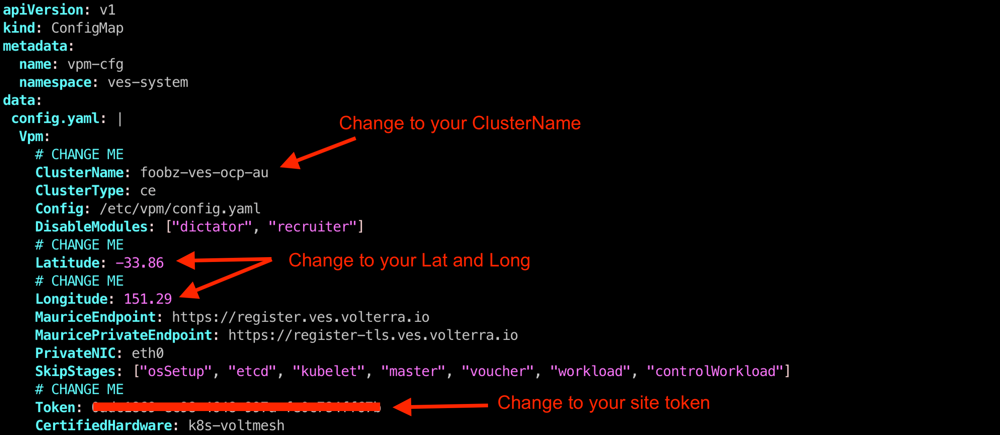

================================================================
Multi-Cluster, Multi-Cloud Networking for Kubernetes - OpenShift
================================================================

.. contents:: Table of Contents

Objective
################################

**Steps 1 - OCP Environment**

**Step 2 - Deploy Cloud Mesh Pod**

**Step 2 - Deploy Cloud Mesh Pod**

**Step 3 - Deploy Cloud Mesh Node**

**Step 4 - Deploy application on OpenShift**

Step 1 - OCP Environment
################################
1.1  Deploy/Ensure OpenShift Cluster and Ready

Building an OCP cluster is beyond the scope of this guide. Please refer to RedHat official documentation. Hence, assumption that you already have an existing OCP up and running. With minor changes, this instruction can be use for non-OCP – EKS, AKS and GKE.

Example of my OCP Environment used in this guide.

- ocp-au - 3 node cluster located in Australia DC
- ocp-sg - Single node cluster locatated in Singpaore DC
- ocp-hk - Single noe cluster located in Hong Kong DC

::

    fbchan@forest:~/ocp-au$ oc get node
    NAME                      STATUS   ROLES           AGE    VERSION
    ocp-au1.ocp.edgecnf.com   Ready    master,worker   163d   v1.22.8+9e95cb9
    ocp-au2.ocp.edgecnf.com   Ready    master,worker   163d   v1.22.8+9e95cb9
    ocp-au3.ocp.edgecnf.com   Ready    master,worker   163d   v1.22.8+9e95cb9
    
    fbchan@forest:~/ocp-sg$ oc get node
    NAME                     STATUS   ROLES           AGE    VERSION
    ocp-sg.ocp.edgecnf.com   Ready    master,worker   275d   v1.23.5+3afdacb
    
    fbchan@forest:~/ocp-hk$ oc get node
    NAME                     STATUS   ROLES           AGE    VERSION
    ocp-hk.ocp.edgecnf.com   Ready    master,worker   159d   v1.22.8+9e95cb9

1.2 Enable/Ensure kernel hugepages available and sufficient.

Note: Only the ocp-au cluster will be shown. Repeat similar task for ocp-sg and ocp-hk

::

    fbchan@forest:~/ocp-au$ oc get node ocp-au1.ocp.edgecnf.com -o jsonpath="{.status.allocatable.hugepages-2Mi}"
    0
    
    fbchan@forest:~/ocp-au$ oc get node ocp-au2.ocp.edgecnf.com -o jsonpath="{.status.allocatable.hugepages-2Mi}"
    0
    
    fbchan@forest:~/ocp-au$ oc get node ocp-au3.ocp.edgecnf.com -o jsonpath="{.status.allocatable.hugepages-2Mi}"
    0

Label nodes (e.g. worker node) with hugepages enabled. In this demo environment, master node also the worker nodes.

::

    fbchan@forest:~/ocp-au$ oc get node
    NAME                      STATUS   ROLES           AGE     VERSION
    ocp-au1.ocp.edgecnf.com   Ready    master,worker   163d    v1.22.8+9e95cb9
    ocp-au2.ocp.edgecnf.com   Ready    master,worker   163d   v1.22.8+9e95cb9
    ocp-au3.ocp.edgecnf.com   Ready    master,worker   163d   v1.22.8+9e95cb9
    
    oc label node ocp-au1.ocp.edgecnf.com node-role.kubernetes.io/worker-hp=
    oc label node ocp-au2.ocp.edgecnf.com node-role.kubernetes.io/worker-hp=
    oc label node ocp-au3.ocp.edgecnf.com node-role.kubernetes.io/worker-hp=
    
    fbchan@forest:~/ocp-au$ oc label node ocp-au1.ocp.edgecnf.com node-role.kubernetes.io/worker-hp=
    node/ocp-au1.ocp.edgecnf.com labeled
    fbchan@forest:~/ocp-au$ oc label node ocp-au2.ocp.edgecnf.com node-role.kubernetes.io/worker-hp=
    node/ocp-au2.ocp.edgecnf.com labeled
    fbchan@forest:~/ocp-au$ oc label node ocp-au3.ocp.edgecnf.com node-role.kubernetes.io/worker-hp=
    node/ocp-au3.ocp.edgecnf.com labeled
    
    fbchan@forest:~/ocp-au$ oc get node
    NAME                      STATUS   ROLES                     AGE     VERSION
    ocp-au1.ocp.edgecnf.com   Ready    master,worker,worker-hp   163d    v1.22.8+9e95cb9
    ocp-au2.ocp.edgecnf.com   Ready    master,worker,worker-hp   163d   v1.22.8+9e95cb9
    ocp-au3.ocp.edgecnf.com   Ready    master,worker,worker-hp   163d   v1.22.8+9e95cb9

Apply OCP tuned operator and machine config operator to enable hugepages.

1-hugepages-tuned-boottime.yaml

::

    apiVersion: tuned.openshift.io/v1
    kind: Tuned
    metadata:
      name: hugepages
      namespace: openshift-cluster-node-tuning-operator
    spec:
      profile:
      - data: |
          [main]
          summary=Boot time configuration for hugepages
          include=openshift-node
          [bootloader]
          cmdline_openshift_node_hugepages=hugepagesz=2M hugepages=1792
        name: openshift-node-hugepages
    
      recommend:
      - machineConfigLabels:
          machineconfiguration.openshift.io/role: "worker-hp"
        priority: 30
        profile: openshift-node-hugepages

2-hugepages-mcp.yaml

::

    apiVersion: machineconfiguration.openshift.io/v1
    kind: MachineConfigPool
    metadata:
      name: worker-hp
      labels:
        worker-hp: ""
    spec:
      machineConfigSelector:
        matchExpressions:
          - {key: machineconfiguration.openshift.io/role, operator: In, values: [worker,worker-hp]}
      nodeSelector:
        matchLabels:
          node-role.kubernetes.io/worker-hp: ""

::

    fbchan@forest:~/ocp-au$ oc create -f 1-hugepages-tuned-boottime.yaml
    tuned.tuned.openshift.io/hugepages created
    
    fbchan@forest:~/ocp-au$ oc create -f 2-hugepages-mcp.yaml
    machineconfigpool.machineconfiguration.openshift.io/worker-hp created

    
Depends on OCP version, if you have access to worker nodes, you can also enable hugepages by editing /etc/sysctl.conf. Example if you enable hugepage using sysctl instead of OCP tuned and mcp operator.

::

    sudo vi /etc/sysctl.conf
    vm.nr_hugepages = 1768
    
    sudo sysctl -p

Reboot worker nodes - if neccessary and validate hugepages

::

    fbchan@forest:~/ocp-au$ oc get node ocp-au1.ocp.edgecnf.com -o jsonpath="{.status.allocatable.hugepages-2Mi}"
    3536Mi
    
    fbchan@forest:~/ocp-au$ oc get node ocp-au2.ocp.edgecnf.com -o jsonpath="{.status.allocatable.hugepages-2Mi}"
    3536Mi
    
    fbchan@forest:~/ocp-au$ oc get node ocp-au3.ocp.edgecnf.com -o jsonpath="{.status.allocatable.hugepages-2Mi}"
    3536Mi

Do not continue until you have hugepages configured. Example above shown that I had hugepage configured.

1.3 Ensure StorageClass configured and Persistent Volume (PVC) working.

Deployment of CE site on K8S require persistent volume (PV). If you don’t have pv configured, here an example to deploy a NFS provisioner for OCP.

Assuming you already have an NFS server running (e.g. Linux NFS) on a remote server. In my example, 10.176.10.122 is my nfs server, /home/nfs is my nfs path

::

  helm repo add nfs-subdir-external-provisioner https://kubernetes-sigs.github.io/nfs-subdir-external-provisioner/

  helm repo update
  
  oc create namespace openshift-nfs-storage
  
  oc label namespace openshift-nfs-storage "openshift.io/cluster-monitoring=true"
  
  helm install nfs nfs-subdir-external-provisioner/nfs-subdir-external-provisioner \
  --set nfs.server=10.176.10.122 \
  --set nfs.path=/home/nfs \
  --set storageClass.name=managed-nfs \
  --set storageClass.defaultClass=true \
  --set storageClass.onDelete=delete \
  -n openshift-nfs-storage --create-namespace
  
  oc patch storageclass managed-nfs -p '{"metadata": {"annotations":{"storageclass.kubernetes.io/  is-default-class":"true"}}}'

Validate to make sure nfs pod is running

::

  fbchan@forest:~/ocp-au$ oc -n openshift-nfs-storage get pod
  NAME                                      READY   STATUS    RESTARTS   AGE
  nfs-client-provisioner-7cdf6c5f86-dkhkf   1/1     Running   26         152d
  
  fbchan@forest:~/ocp-au$ oc get sc
  NAME                    PROVISIONER                                   RECLAIMPOLICY   VOLUMEBINDINGMODE     ALLOWVOLUMEEXPANSION   AGE
  managed-nfs (default)   k8s-sigs.io/nfs-subdir-external-provisioner   Delete          Immediate             false                  152d

  
Use the sample statefulset manifest below to test to ensure PV and PVC working.

::

  apiVersion: apps/v1
  kind: StatefulSet
  metadata:
    name: busybox
  spec:
    serviceName: busybox
    replicas: 1
    selector:
      matchLabels:
        app: busybox
    template:
      metadata:
        labels:
          app: busybox
      spec:
        containers:
          - image: busybox
            args: [/bin/sh, -c, 'sleep 9999' ]
            volumeMounts:
              - mountPath: /test
                name: busybox-pvc
            name: busybox
    volumeClaimTemplates:
    - metadata:
        name: busybox-pvc
      spec:
        accessModes: [ "ReadWriteOnce" ]
        resources:
          requests:
            storage: 1Gi

Example output

::

  fbchan@forest:~/ocp-au$ oc apply -f busybox-pvc.yaml
  statefulset.apps/busybox created
  
  fbchan@forest:~/ocp-au$ oc get pvc
  NAME                    STATUS   VOLUME                                     CAPACITY   ACCESS MODES     STORAGECLASS   AGE
  busybox-pvc-busybox-0   Bound    pvc-08882259-4ca5-45ee-a426-a2ff69946dfa   1Gi        RWO              managed-nfs    49s
  
  fbchan@forest:~/ocp-au$ oc delete -f busybox-pvc.yaml
  statefulset.apps "busybox" deleted

Step 2 - Deploy Cloud Mesh Pod
################################

2.1  Download ce_k8s.yaml manifest.

Download CE on K8S site manifest. Manifest can e downloaded ad https://gitlab.com/volterra.io/volterra-ce

::

  fbchan@forest:~/ocp-au$ wget https://gitlab.com/volterra.io/volterra-ce/-/raw/master/k8s/ce_k8s.yml
  --2022-10-26 06:24:27--  https://gitlab.com/volterra.io/volterra-ce/-/raw/master/k8s/ce_k8s.yml
  Resolving gitlab.com (gitlab.com)... 172.65.251.78, 2606:4700:90:0:f22e:fbec:5bed:a9b9
  Connecting to gitlab.com (gitlab.com)|172.65.251.78|:443... connected.
  HTTP request sent, awaiting response... 200 OK
  Length: 6539 (6.4K) [text/plain]
  Saving to: ‘ce_k8s.yml’
  
  ce_k8s.yml                                              100%  [======================================================================================================
  ======================>]   6.39K  --.-KB/s    in 0s
  
  2022-10-26 06:24:28 (94.9 MB/s) - ‘ce_k8s.yml’ saved [6539/6539]

2.2 Update ce_k8s.yaml deployment according to your env.

Depend on your environment, updates appropriately.

Uncomment Service definition to enable nodeport for site to site access (e.g. site mesh group).

::

  # CHANGE ME
  # PLEASE UNCOMMENT TO ENABLE SITE TO SITE ACCESS VIA NODEPORT
  ---
  apiVersion: v1
  kind: Service
  metadata:
    name: ver-nodeport-ver-0
    namespace: ves-system
    labels:
      app: ver
  spec:
    type: NodePort
    ports:
      - name: "ver-ike"
        protocol: UDP
        port: 4500
        targetPort: 4500
        nodePort: 30500
    selector:
      statefulset.kubernetes.io/pod-name: ver-0
  ---
  apiVersion: v1
  kind: Service
  metadata:
    name: ver-nodeport-ver-1
    namespace: ves-system
    labels:
      app: ver
  spec:
    type: NodePort
    ports:
      - name: "ver-ike"
        protocol: UDP
        port: 4500
        targetPort: 4500
        nodePort: 30501
    selector:
      statefulset.kubernetes.io/pod-name: ver-1
  ---
  apiVersion: v1
  kind: Service
  metadata:
    name: ver-nodeport-ver-2
    namespace: ves-system
    labels:
      app: ver
  spec:
    type: NodePort
    ports:
      - name: "ver-ike"
        protocol: UDP
        port: 4500
        targetPort: 4500
        nodePort: 30502
    selector:
      statefulset.kubernetes.io/pod-name: ver-2

2.3 Apply ce_k8s.yaml deployment.

::

  fbchan@forest:~/ocp-au$ oc create ns ves-system
  namespace/ves-system created
  
  fbchan@forest:~/ocp-au$ oc adm policy add-scc-to-user privileged -z default -n ves-system
  clusterrole.rbac.authorization.k8s.io/system:openshift:scc:privileged added: "default"
  
  fbchan@forest:~/ocp-au$ oc create -f ce_k8s.yml
  namespace/ves-system created
  serviceaccount/volterra-sa created
  role.rbac.authorization.k8s.io/volterra-admin-role created
  rolebinding.rbac.authorization.k8s.io/volterra-admin-role-binding created
  daemonset.apps/volterra-ce-init created
  serviceaccount/vpm-sa created
  role.rbac.authorization.k8s.io/vpm-role created
  clusterrole.rbac.authorization.k8s.io/vpm-cluster-role created
  rolebinding.rbac.authorization.k8s.io/vpm-role-binding created
  clusterrolebinding.rbac.authorization.k8s.io/vpm-sa created
  clusterrolebinding.rbac.authorization.k8s.io/ver created
  configmap/vpm-cfg created
  statefulset.apps/vp-manager created
  service/vpm created
  
  fbchan@forest:~/ocp-au$ oc -n ves-system get pod,pvc
  NAME                         READY   STATUS    RESTARTS   AGE
  pod/volterra-ce-init-2kdpd   1/1     Running   0          2m20s
  pod/volterra-ce-init-4hh6m   1/1     Running   0          2m20s
  pod/volterra-ce-init-tzwds   1/1     Running   0          2m20s
  pod/vp-manager-0             1/1     Running   0          68s
  pod/vp-manager-1             1/1     Running   0          77s
  pod/vp-manager-2             1/1     Running   0          88s
  
  NAME                                        STATUS   VOLUME                                     CAPACITY   ACCESS   MODES   STORAGECLASS   AGE
  persistentvolumeclaim/data-vp-manager-0     Bound    pvc-1d28203e-4a2d-4126-af4d-825d4bbc9d07   1Gi          RWO            managed-nfs    2m20s
  persistentvolumeclaim/data-vp-manager-1     Bound    pvc-9eeebb9f-c8e9-46fd-8878-4eb00212d79b   1Gi          RWO            managed-nfs    2m8s
  persistentvolumeclaim/data-vp-manager-2     Bound    pvc-e095bbfe-d92e-46a0-8aec-b4dc88906f19   1Gi          RWO            managed-nfs    118s
  persistentvolumeclaim/etcvpm-vp-manager-0   Bound    pvc-490d792e-a1ad-416f-afae-d5d687b10a6d   1Gi          RWO            managed-nfs    2m20s
  persistentvolumeclaim/etcvpm-vp-manager-1   Bound    pvc-228600ea-256b-4214-bc20-02de68011baa   1Gi          RWO            managed-nfs    2m8s
  persistentvolumeclaim/etcvpm-vp-manager-2   Bound    pvc-dc221ff8-695f-45ae-8b84-36ba190f5563   1Gi          RWO            managed-nfs    118s
  persistentvolumeclaim/varvpm-vp-manager-0   Bound    pvc-aa2b9eb5-2c2d-4abd-94e1-eb302eedb47a   1Gi          RWO            managed-nfs    2m20s
  persistentvolumeclaim/varvpm-vp-manager-1   Bound    pvc-4a85c2ac-d78b-43e5-8a70-924f9caea852   1Gi          RWO            managed-nfs    2m8s
  persistentvolumeclaim/varvpm-vp-manager-2   Bound    pvc-de41afd2-f09f-4fc3-a0bd-fa8bc77c37ff   1Gi          RWO            managed-nfs    118s

2.4 Approve registration of VER on F5 XC Console

.. figure:: ./images/approve-reg.png

Example running F5 XC Cloud mesh pod on OCP

::

  fbchan@forest:~/ocp-au$ oc -n ves-system get pod
  NAME                          READY   STATUS    RESTARTS      AGE
  etcd-0                        2/2     Running   0             13h
  etcd-1                        2/2     Running   0             13h
  etcd-2                        2/2     Running   0             13h
  prometheus-857f979859-cmts7   5/5     Running   0             13h
  ver-0                         16/16   Running   0             13h
  ver-1                         16/16   Running   0             13h
  ver-2                         16/16   Running   0             13h
  volterra-ce-init-2kdpd        1/1     Running   0             13h
  volterra-ce-init-4hh6m        1/1     Running   0             13h
  volterra-ce-init-tzwds        1/1     Running   0             13h
  vp-manager-0                  1/1     Running   2 (13h ago)   13h
  vp-manager-1                  1/1     Running   1 (13h ago)   13h
  vp-manager-2                  1/1     Running   2 (13h ago)   13h

2.5 Create ver-dns service

This is to ensure that ver-dns service has a static ClusterIP. During software updates, ver-0, ver-1 and ver-2 will be restarted and ver pods IP may change. 

::

  fbchan@forest:~/ocp-au$ oc -n ves-system get pod -o wide -l app=ver
  NAME    READY   STATUS    RESTARTS        AGE   IP             NODE                      NOMINATED NODE     READINESS GATES
  ver-0   16/16   Running   15 (162m ago)   12h   10.130.1.132   ocp-au1.ocp.edgecnf.com   <none>           <none>
  ver-1   16/16   Running   19 (101m ago)   12h   10.128.0.44    ocp-au2.ocp.edgecnf.com   <none>           <none>
  ver-2   16/16   Running   7 (5m23s ago)   12h   10.129.0.144   ocp-au3.ocp.edgecnf.com   <none>           <none>

dns-ver-svc.yaml

::

  apiVersion: v1
  kind: Service
  metadata:
    name: ver-dns
    namespace: ves-system
    labels:
      app: ver
  spec:
    ports:
      - name: "ver-dns-udp"
        protocol: UDP
        port: 53
        targetPort: 53
      - name: "ver-dns-tcp"
        protocol: TCP
        port: 53
        targetPort: 53
    selector:
      app: ver

:: 

  kubectl -n ves-system apply -f dns-ver-svc.yaml

  fbchan@forest:~/ocp-au$ oc -n ves-system get svc ver-dns
  NAME      TYPE        CLUSTER-IP    EXTERNAL-IP   PORT(S)         AGE
  ver-dns   ClusterIP   172.30.5.75   <none>        53/UDP,53/TCP   143d

2.6 Update OCP DNS Operator to delegate domain to ver-dns

DNS default configmap before update with DNS Operator

::

  fbchan@forest:~/ocp-au$ oc -n openshift-dns get cm dns-default -o yaml
  apiVersion: v1
  data:
    Corefile: |
      .:5353 {
          bufsize 512
          errors
          health {
              lameduck 20s
          }
          ready
          kubernetes cluster.local in-addr.arpa ip6.arpa {
              pods insecure
              fallthrough in-addr.arpa ip6.arpa
          }
          prometheus 127.0.0.1:9153
          forward . /etc/resolv.conf {
              policy sequential
          }
          cache 900 {
              denial 9984 30
          }
          reload
      }
  kind: ConfigMap
  metadata:
    creationTimestamp: "2022-11-01T00:22:52Z"
    labels:
      dns.operator.openshift.io/owning-dns: default
    name: dns-default
    namespace: openshift-dns
    ownerReferences:
    - apiVersion: operator.openshift.io/v1
      controller: true
      kind: DNS
      name: default
      uid: 1c629cc8-f060-4e99-a8d1-dd5c2be42ccd
    resourceVersion: "2184645"
    uid: d3866bc7-31f5-453f-b9d7-6315d85af400

Upates DNS operator to delegate xcmesh.global to Cloud Mesh pod

dns-operator-ocp-au.yaml

::

  apiVersion: operator.openshift.io/v1
  kind: DNS
  metadata:
    name: default
  spec:
    servers:
    - name: xcmesh-global-dns
      zones:
        - xcmesh.global
      forwardPlugin:
        upstreams:
          - 172.30.5.75

oc apply -f dns-operator-ocp-au.yaml

::

  fbchan@forest:~/ocp-au$ oc apply -f dns-operator-ocp-au.yaml
  Warning: resource dnses/default is missing the kubectl.kubernetes.io/last-applied-configuration annotation which   is required by oc apply. oc apply should only be used on resources created declaratively by either oc create   --save-config or oc apply. The missing annotation will be patched automatically.
  dns.operator.openshift.io/default configured

After DNS operator updated

::

  apiVersion: v1
  data:
    Corefile: |
      # xcmesh-global-dns
      xcmesh.global:5353 {
          forward . 172.30.5.75
          errors
          bufsize 512
      }
      .:5353 {
          bufsize 512
          errors
          health {
              lameduck 20s
          }
          ready
          kubernetes cluster.local in-addr.arpa ip6.arpa {
              pods insecure
              fallthrough in-addr.arpa ip6.arpa
          }
          prometheus 127.0.0.1:9153
          forward . /etc/resolv.conf {
              policy sequential
          }
          cache 900 {
              denial 9984 30
          }
          reload
      }
  kind: ConfigMap
  metadata:
    creationTimestamp: "2022-11-01T00:22:52Z"
    labels:
      dns.operator.openshift.io/owning-dns: default
    name: dns-default
    namespace: openshift-dns
    ownerReferences:
    - apiVersion: operator.openshift.io/v1
      controller: true
      kind: DNS
      name: default
      uid: 1c629cc8-f060-4e99-a8d1-dd5c2be42ccd
    resourceVersion: "8590070"
    uid: d3866bc7-31f5-453f-b9d7-6315d85af400 

Repeat registration for ocp-sg and ocp-hk

.. figure:: ./images/ocp-sites.png

Step 3 - Deploy Cloud Mesh Node
####################################
3.1 Deploy Cloud Mesh Node.

3.2 Setup service discovery of Mesh Node to OCP

.. figure:: ./images/ocp-sd02.png

3.3 Create service account for Mesh node service discovery.

3.4 Setup pod network routing for ovn-kubernetes.

.. figure:: ./images/ocp-sd04.png

.. figure:: ./images/ocp-sd05.png

Step 4 - Deploy application on OpenShift
###############################################

4.1 Install Apps (Arcadia)

4.2 Create HTTP LB (origin pool, advertise policy, WAF policy, API Security)

4.3 Terraform

4.4 Install nginx web server.

